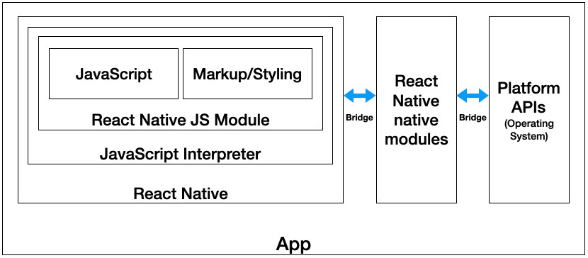
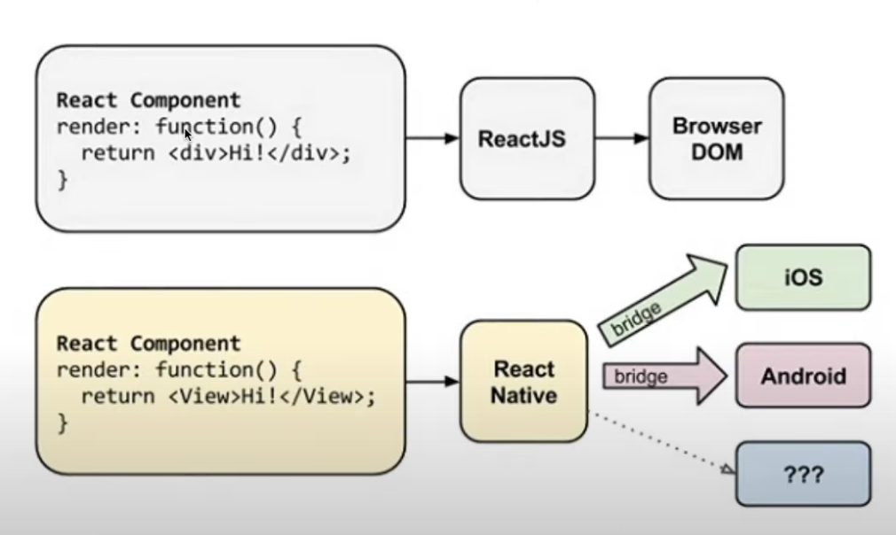
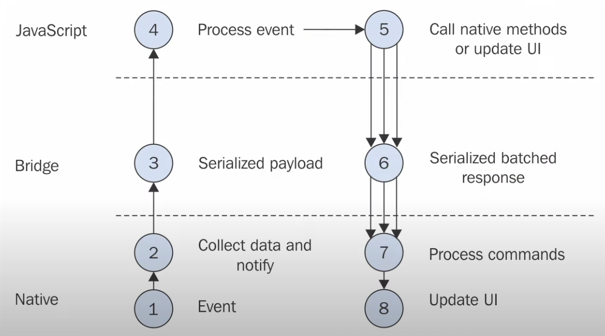

# RN 요구사항

RN의 단점 중 하나는 SW 개발 환경을 갖추기 어려운 점이다.
웹, 모바일 웹 개발이 아닌 `앱`을 만들기 때문. 따라서 앱을 만들기 위한 모든 프로그램을 다운받아야 한다.
- Android App ? Android Studio
- iOS ? Xcode ...

## React native
- 왜 Java와 Xcode가 설치되어야 할까?
  - RN에는 Bridge 들을 통해 코드가 운영체제들과 통신할 수 있도록 하는 인프라시설이 있다.
  - JS 코드를 쓰고, 이 모든 인프라들은 Android-`.apk`, iOS-`.ipa`가 된다.
  - 즉, <U>RN으로 만든 앱을 통해 각 운영체제에 맞도록 build, compile 해야하기 때문</U>
  - RN 앱을 다운 받으면, 이 브릿지가 포함된 모든 인프라들을 다운받고, 이 인프라들은 JS code와 OS가 의사소통할 수 있게 해 줌
  - 이런 인프라들은 웬만한 앱에서 동일하다.

### 그래서 RN이 뭔데?
React Native는 사용자와 OS(AOS,iOS) 사이의 인터페이스 역할을 한다.
RN 코드를 작성하면, iOS 또는 Java 코드로 번역이 되어 각 OS에 맞도록 앱이 그려지게 됨.

Bride를 통해 각 운영체제에 맞게 번역되는 과정까지 구현할 필요 없지만, 원리를 알아보자.
실제로 RN이 작동하는 원리를 설명하는 그림이다.

1~2번. Native가 event listening함. 화면을 통제하고 있다.  
3~4번. event가 발생하면 Native는 브릿지를 통해 JS에 JSON 형태로 메시지를 전달함  
4번. 사용자는 event를 기다리고 있고, event를 이용해 어떠한 코드를 작성하고 실행함. 
~5번. 다시 Native OS로 이벤트를 전달하게 된다. 

우리는 사실상 단지 메시지를 주고받는 것이고, 4, 5번 과정만 구현해주면 된다.

### EXPO
테스트 실행, 프로토타입을 위한 개발 도구로, 다른 프로그램 설치 없이 간단하고 빠르게 앱을 실행할 수 있다.
Expo는 위 그림 중 `JavaScript`, `Markup/Styling` 부분만 작성하면 됨.

Expo를 사용한다면 앱 소스코드를 compile 할 필요가 없다. Expo의 인프라가 해주기 때문.
Expo는 RN 코드를 곧바로 휴대폰으로 전송시키고, 휴대폰 Expo에서 앱을 바로 확인할 수 있게 된다. 
- [Expo 설치하기](https://expo.dev/tools)
- Watchman 설치하기(for Mac) - `brew install watchman`

