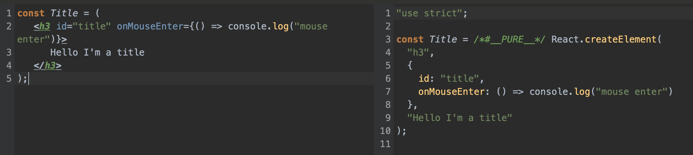

#노마드-리액트 기초 시작하기
2022.6.28
- 비, 바람 엄청나다.
- 노마드 리액트 네이티브 강의 듣기 전 리액트 웹 기초 수강을 권장하여 시작해본 리액트 기초.
기본에 충실하게 잘 알려주시는 것 같음.

## 리액트 설치
   - [리액트 설치] https://unpkg.com/react@17.0.2/umd/react.production.min.js
   - [리액트돔 설치] https://unpkg.com/react-dom@17.0.2/umd/react-dom.production.min.js

   - React : 애플리케이션을 interactive 하도록 만들어주는 라이브러리. 엔진과 같다
   - React-DOM : 라이브러리 또는 패키지. 모든 react element들을 HTML body 안에 둘 수 있도록 해준다.
   - reactDOM.render() : react element를 갖고 HTML로 만들어 배치하는 것, 즉 사용자에게 보여줄 수 있도록 한다.
   


## 바닐라JS와의 차이점
   - 구현순서에서 차이가 난다.
     - 바닐라JS : HTML -> JS
     - React : JS -> HTML
   

## [JSX](https://ko.reactjs.org/docs/introducing-jsx.html)
JavaScript를 확장한 문법이다. getElementById 등을 사용하다가 JSX를 사용하려고 하면 에러가 난다.
브라우저는 JSX를 invalid code로 인식해 이해하지 못한다. [Babel](https://babeljs.io)을 import해서 JSX 코드를 브라우저가 이해할 수 있도록 변환해준다. <br>
react code를 감싸고 있는 script 태그에 type 명시 필요. `<script type="text/babel>` <br><br>
- [바벨 설치] https://unpkg.com/@babel/standalone/babel.min.js


바벨 홈페이지 > Try it out 에서 온라인으로 변환된 모습을 확인해볼수도 있다.




```
const element = (
   <h1 className="greeting">
      Hello, World!
   </h1>
);
```
Babel은 이러한 JSX 코드를
```
const element = React.createElement(
   'h1',
   {className : 'greeting'},
   'Hello, World!'
);
```
이렇게 브라우저가 이해할 수 있도록 변환해준다.


### 렌더링
이렇게 작성한 react 코드를 사용자에게 보여줄 때 지금까지 이렇게 적었다. 
```
const root = document.getElementById("root");
...
const container  = React.createElement("div", null, [Title, Button]);
ReactDOM.render(container, root);
```
이를 JSX로 변경하기 위해서는 Button, Title Element를 함수로 변경해야 한다.
arrow function`() => ` 으로 함수화 하거나, function 키워드를 사용할 수 있다.

```
// arrow funtion
const Title = () =>  (
 <h3 id="title" onMouseEnter={() => console.log("mouse enter")}>
   Hello I'm a title
 </h3>
);

// function
function Title() {
  return(
     <h3 id="title" onMouseEnter={() => console.log("mouse enter")}>
        Hello I'm a title
     </h3>
  );
}
```
<br><br>
이렇게 함수로 변경한 Element를 `컴포넌트화` 해서 사용하게 된다.
여기서 컴포넌트 이름은 반드시 대문자로 시작되어야 한다.
소문자로 시작되면 react와 JSX는 일반 button 요소로 이해하게 된다.
**(중요!) 내가 만든 컴포넌트를 렌더링해서 다른 부분에서 사용할 때는 반드시 대문자로 시작해야 한다.**
```
const Container  = <div><Title /> <Button /> </div>
ReactDOM.render(<Container />, root);
```

<br>
이처럼 JSX 는 애플리케이션을 작은 요소로 나눠 관리할 수 있도록 해준다. 여러 요소로 작게 잘라 나중에 합쳐주기만 하면 된다.
버튼과 텍스트를 각자 만들고, 함께 렌더링 한다.

---

## 공부하면서 궁금해진 것들
- What is the 'DOM'?
- JSX 홈페이지 정독